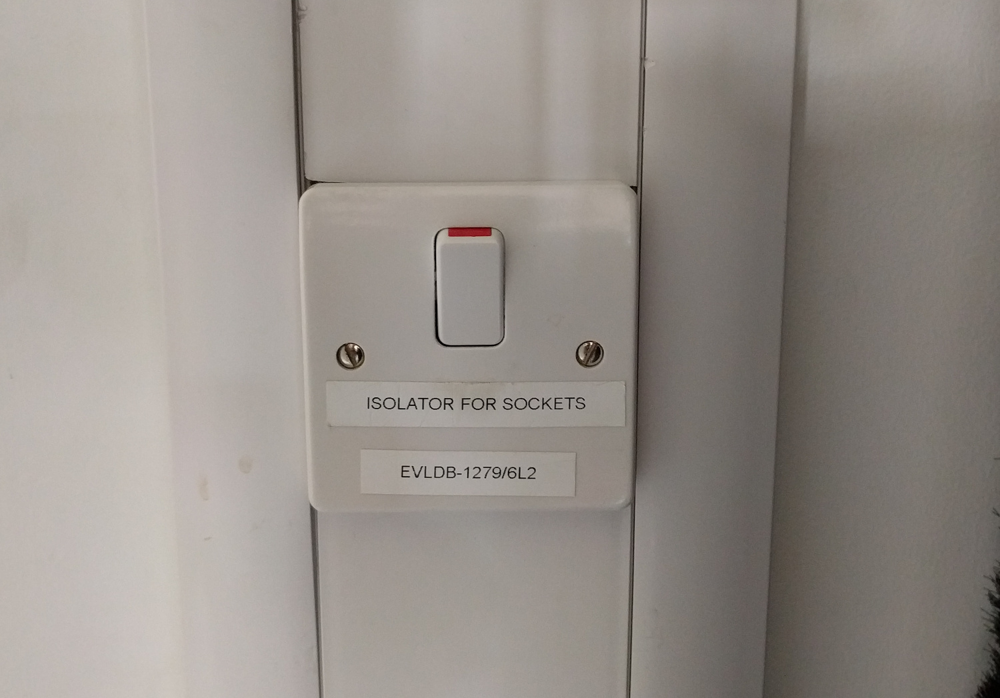
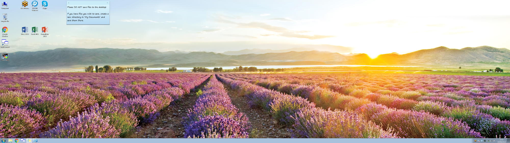
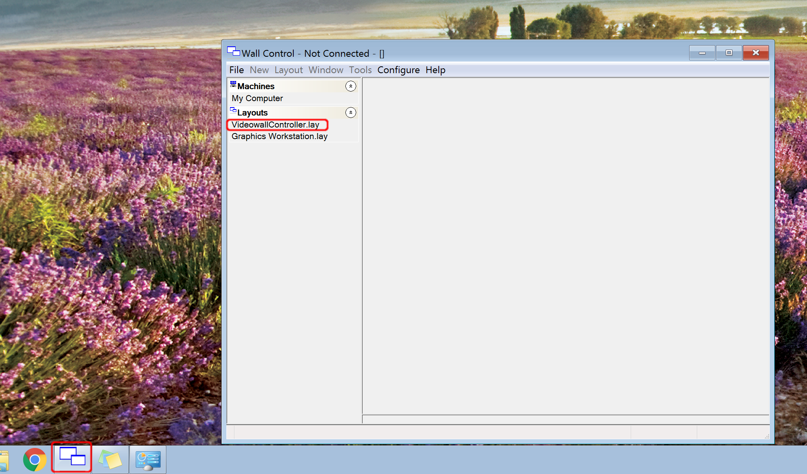

# Basic Operation

## Switching the video wall on {#on}

If necessary, the video wall can be switched on with the power switch located on the wall to the left-hand side of it.  It looks like a light switch and is photographed below.

## Selecting the Video Wall Controller {#controller}

There are two computers which can use the video wall.  For general use (including videoconferencing), the *Video Wall Controller* machine should be selected.  Usually this is selected by default.  If the desktop background is a field of lavenders (see below), the correct machine is selected and is ready to use.

If you see a different screen (probably one with a satellite image of the Earth), then the video wall has been left with the wrong machine selected.  In that case, move the mouse to the bottom of the screen to make the menu bar visible.  Now open the "Wall Control" software (it will either already be running and minimised, or will require starting - it is pinned as a favourite to the top of the Start Menu).

From within the wall control software, select the File menu and choose the item "VideowallController.lay".  Do not save any changes.  The video wall is now ready to be used.

## Switching the video wall off {#off}

When you have finished using the video wall, close all of the applications you have been using, and switch it off using **only** the power switch illustrated above.  **Do not** use the shutdown/hibernate options in the Windows start menu - you must **only** switch the video wall off with the power switch. 
