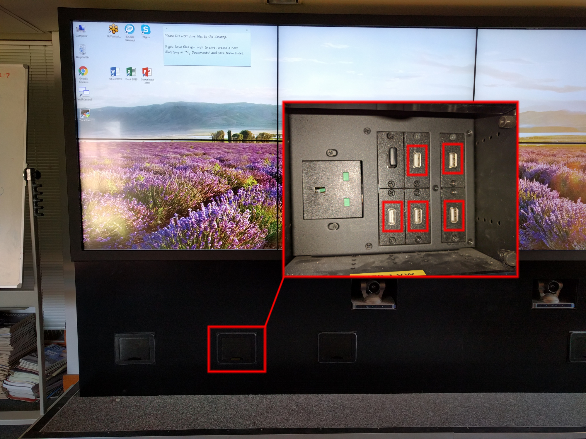

# Using the Video Wall to display presentations

The video wall has Microsoft PowerPoint installed for viewing presentations.  For the most part this is identical to displaying PowerPoint presentations on any other Windows PC.  The only things to note are how to load the presentation onto the video wall, and how to display them in a way which is more suited to a large wall.

## Locating the USB sockets {#usb}
If your presentation is stored on a USB drive, it can be plugged into the USB sockets on the front of the videowall, located as indicated in the photograph below:

If you wish to save any presentations to the video wall, please create a directory with your name in the documents library.  Any data saved directly to the desktop clutters up the interface, making it harder for other users and *will* be deleted.

## Displaying presentations in a window {#window}

By default, PowerPoint presentations will be displayed full screen and centred in the screen.  If this is not desirable (for example you wish to display 2 presentations simultaneously, or all of the meeting participants are located on one side of the wall), you can display the presentation in its own window.  To do this, within PowerPoint, click the "Slide Show" ribbon, select "Set up slide show" and click the "Browsed by an individual (window)" radio button:

The presentation will now be displayed in a window which can be resized and placed as desired.
