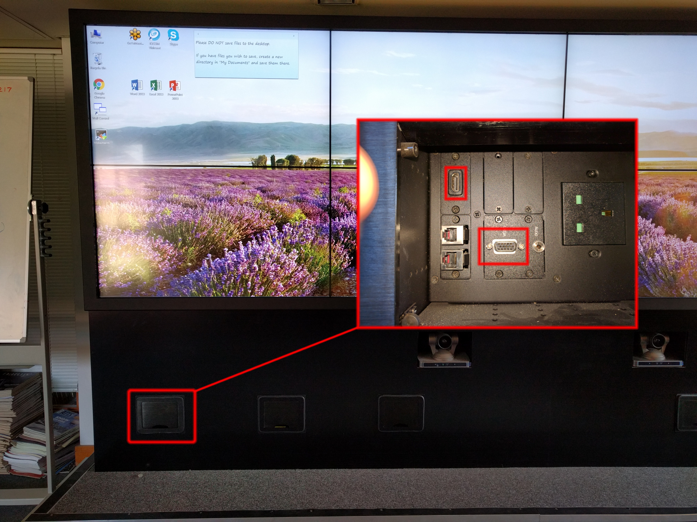
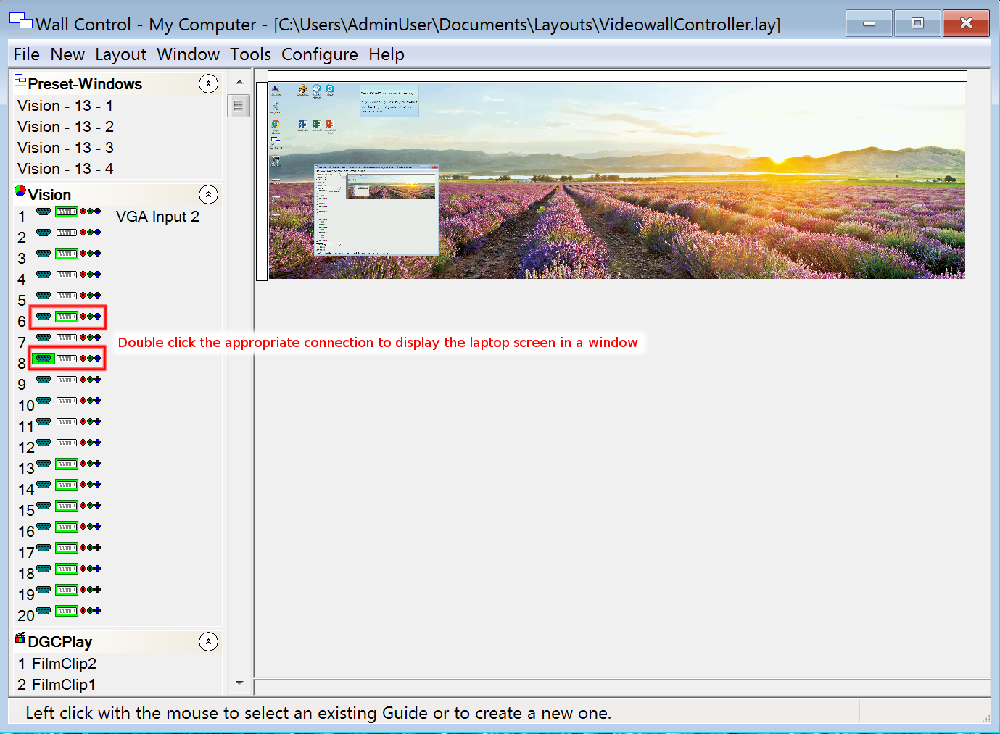

# Connecting a laptop to the Video Wall

To connect a laptop to the video wall, either a VGA or an HDMI connection can be used.  VGA and HDMI cables can be found to the right-hand side of the video wall (**where they should be returned when finished with**).  The VGA and HDMI ports are located next to the USB sockets, as shown below:

Once the laptop has been plugged into the wall, the "Wall Control" software should be opened (if it is not already running minimised, it is pinned to the top of the Windows start menu).  If it was not already open, you should select the "VideowallController.lay" option (disacarding any changes).  Now, all of the available ports are listed on the left-hand side of the window, as per the screenshot below.  Either port 6 or port 8 (depending on whether VGA or HDMI is used) will be highlighted in green.  Double clicking this port will display the external laptop screen in a window which can be resized and positioned as desired.  To ensure that the ratio matches that of the laptop input, go to the "Window" menu, choose "Window Properties", and then select the "Maintain aspect ratio of source" option.

