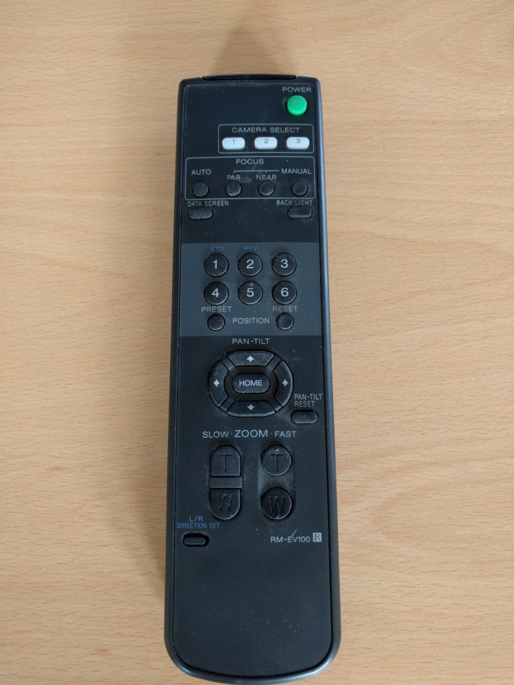
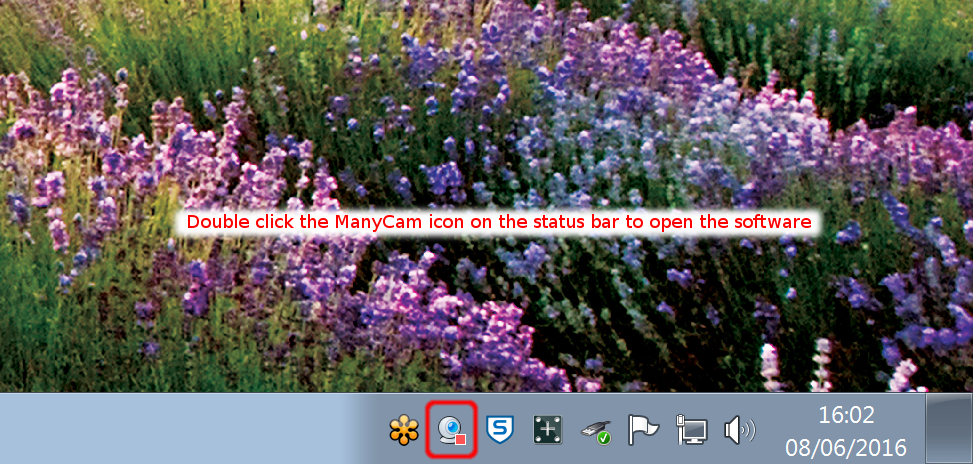

# Video Cameras and Microphones

## Typical behaviour {#typical}

The video wall is connected to three video cameras - two facing the user at the front and one at the back of the room (for broadcasting presentations etc. being given on the video wall). The cameras are full HD, and connected via a video-capture card. The video wall has many inputs into its capture cards, but only the following are applicable to using the cameras:

* Datapath VisionHD4 01: The left-hand camera
* Datapath VisionHD4 02: The rear camera
* Datapath VisionHD4 03: The right-hand camera

These are the names under which the cameras will appear in videoconferencing software.

To control the zoom and pan on the cameras, there is an IR remote control:

To select the camera to use, the buttons "1", "2", and "3" should be used. These correspond to the left, rear, and right cameras respectively. Note that the rear camera is usually left switched off. If you wish to use it, it can be switched on with the IR remote control.

## Skype {#skype}

Skype does not have support for cameras connected via video capture cards, and uses a piece of software named "ManyCam" for camera management. By default Skype should be set to use the "ManyCam Virtual Webcam". If you wish to change the camera being displayed, double click the ManyCam icon in the status bar:

This will open the ManyCam software, where any of the 3 desired cameras can be clicked to select it as the camera for use in Skype. 

## Microphones

There are 4 microphones which feed into the videowall. They are mixed and echo-cancelled and will appear as a single microphone to any software which uses them. The microphones are located in the ceiling, and the device name is simply "Line In" (i.e. **NOT** one of the two devices listed as "Microphone"). This is the default recording device and so generally no changes to anything will be required to use the microphones.

If there are issues with the microphone volume (e.g. it is clipping when people talk loudly), this can often be changed within the videoconferencing software you are using. If this option is not available, the input volume can be adjusted by going to the Control Panel -> Sound -> Recording -> Line In -> Properties -> Levels. There is then a volume slider which will adjust the microphone volume.
