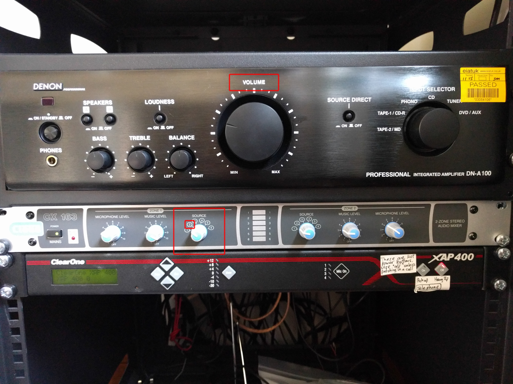

# Sound output

The speakers for the video wall are located just behind the wall itself. Volume should be controlled with the amplified located to the right-hand side of the wall. If no sound is playing, ensure that the source selector on the amplifier is on the correct setting (source 1) and that the volume knob is turned above zero, as shown on the diagram below.

